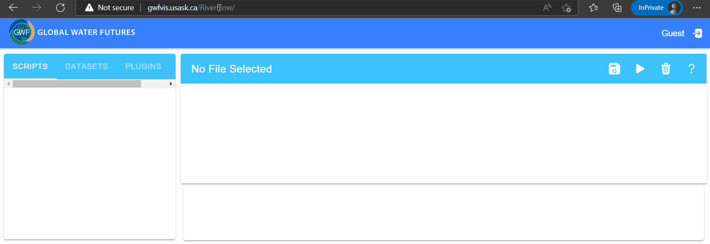
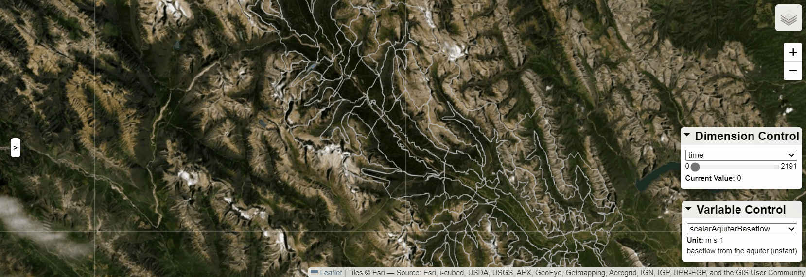
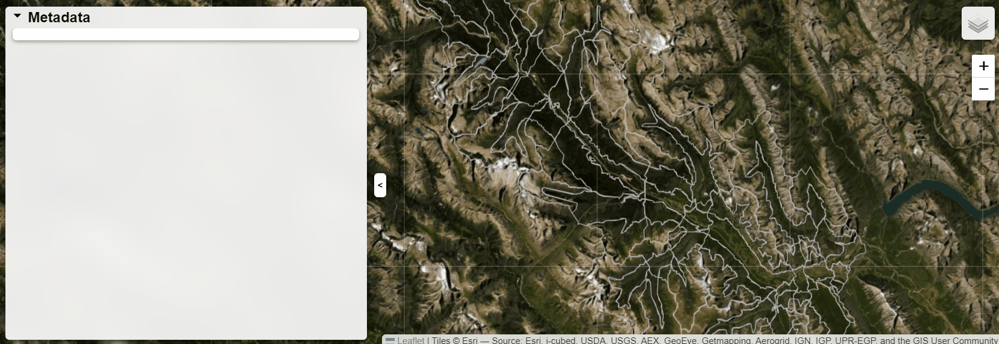

## Getting Started
 
1.	Login with your NSID – click on the top right icon at [GWFVis](http://gwfvis.usask.ca/RiverFlow/).
1.	Create a file by right clicking on the left panel directory labeled with your nsid.
1.	A newly created file will already have some code written in it.
1.	Execute the code by clicking the top right triangle icon. This will create a default layout for geographic visualization in a new tab. 


<!--img src="https://www.cs.usask.ca/faculty/dmondal/Presentations/pic/map.jpg"
     alt="default map"
     style="width: 100px; " /-->

## Understanding the default code
1. Load the default vis configurations.
 
    ```py
    import gwfvis
    vis_config = gwfvis.load_vis_config()
    ```
    The gwfvis api has been imported. A new variable `vis_config` has been initiated with default visualization configuration. You now can add new features to `vis_config` and then visualize it. 

1. Add the default map layer 
    ```py 
    gwfvis.add_map_element(vis_config, 'tile-layer', gwfvis.SATELITTE_LAYER_PROPS)
    ```
    <!-- To add a feature to `vis_config`, we use `gwfvis.add_plugin()` which takes three parameters.
    - The `vis_config` itself
    - The feature to be added. Here we are adding a `SATELLITE_LAYER`, which is already configured in gwfvis for convenience. 
    - [Optional] One of strings `'main'` and `'sidebar'`. This tells whether the user controls for this feature will be added to the main view or to the sidebar. Here we do not create user controls.  -->

1. Set a view (center and zoom) for the map
    ```py
    vis_config['view'] = {
        'center': [51.312588, -116.021118],
        'zoom': 10
    }
    ```
    The string `'view'` is being configured to set the map center and zoom level 
1. Show the visualization
    ```py
    gwfvis.render(vis_config)
    ```
    

## An inspiring example
Try `catchment.py` in [GWFVis](http://gwfvis.usask.ca/RiverFlow/) to explore an interactive visual analytics interface. 


In the following we show how to create various components of the interface using the gwfvis api. We will use the following major functions of gwfvis.

1. `gwfvis.add_map_element()` to add an element to the map layer
1. `gwfvis.add_sidebar_element()` to add an element to the side bar
1. `gwfvis.add_main_view_element()` to add an element over the main view
1. `gwfvis.update_props()` to configure the properties of an element

## Defining a dataset variable

A sample dataset `catchment.gwfvisdb` is being loaded from the datasets directory. 
```py
dataset = 'http://gwfvis.usask.ca/RiverFlow/api/file/fetch/public/datasets/catchment.gwfvisdb'
```

## Adding a new layer to the map

You can add a new layer (e.g., polygons, rivers, etc.) to the map using `gwfvis.add_map_element()` with two parameters. 

1. The `vis_config` itself.
1. The type of the layer (e.g., `'geojson-layer'`, `'tile-layer'`, etc.). See [details](./plugins.md#map-layer).

```py
polygons = gwfvis.add_map_element(
    vis_config, 'geojson-layer' # create the layer
)
```
Configure the properties of the layer using `gwfvis.update_props()`.
```py  
gwfvis.update_props(
    polygons, # configure the properties of the layer
    {   
        'layerName': 'Catchment', # a layer name to show over the map
        'type': 'overlay', # overlay, because map defined as the base layer 
        'dataSource': dataset # data source
    }
)
```
Try `polygons.py` in [GWFVis](http://gwfvis.usask.ca/RiverFlow/).


See [config color schemes](./plugins.md#config-color-schemes) for changing colors of the polygons, or [config style](./plugins.md#config-style) for more details.

<!-- We should chnage the style, not only color [line width - transperancy]-->
 
## Exploring the series data associated with the polygons (e.g., over time, soil depth, etc.)

To explore the series data associated with the polygon layer, you need to create the follwing two controls over the map. 

1. `variable-control`: This allows us to select a particular variable associated to the polygon using a dropdown menu (e.g., temp)
2. `dimension-control`: This allows us to select a dimension of the selected variable over which it varies (e.g., time, soil depth).  

Both of these controls can be added using `gwfvis.add_main_view_element()` and then configuring the properties using `gwfvis.update_props()`.

```py
    variable_control = gwfvis.add_main_view_element(
        vis_config, 'variable-control'    # create the control
    )
    gwfvis.update_props(
        variable_control, # configure the properties of the control
        {    
            'width': '40rem',  # set the width of the container 
            'dataSource': dataset # data source 
        }
    ) 
    dimension_control = gwfvis.add_main_view_element(
        vis_config, 'dimension-control'   # create the control
    )
    gwfvis.update_props(
        dimension_control, # configure the properties of the control
        {     
            'width': '40rem',  # set the width of the container           
            'dataSource': dataset # data source
        }
    ) 
```
When you interact with these controls, the polygon layer gets updated. 
Try `series_data.py` in [GWFVis](http://gwfvis.usask.ca/RiverFlow/).


<!-- ## How to add a legend for a polygon layer?
As the polygons are usually colored, adding a legend would be helpful to understand the colors.

#### Example: Adding a __legend__
1. A sample dataset `catchment.gwfvisdb` is being loaded from the datasets directory. 
    ```py
    dataURL = 'http://gwfvis.usask.ca/RiverFlow/api/file/fetch/public/datasets/catchment.gwfvisdb'
    ```
1. Define the __legend__
    ```py
    legend = {
        'import': 'legend',
        'props': {
            'dataSource': catchment_dataset
        }
    }
    ```
1. Add the __legend__ to `vis_config`
    ```py
    gwfvis.add_plugin(vis_config, legend, 'main')
    ```
    
Check out [config color schemes](#Config-color-schemes) -->
<!-- 
## How to add a series of data to the polygons (e.g., time series, soil depth, etc.)?
When the dataset contains dimensions, we can add add a __dimension control__ to the vis, which provides the ability to change any current dimension to a specific value. The __dimension control__ is imported as `dimension-control`. When you interact with the __dimension control__, the polygon layer would be updated.

#### Example: Creating a __dimension control__
1. Assume we have the dataset `catchment.gwfvisdb` loaded.
    ```py
    dataURL = 'http://gwfvis.usask.ca/RiverFlow/api/file/fetch/public/datasets/catchment.gwfvisdb'
    ```
1. Define the __dimension control__.
    ```py
    dimension_control = {
        'import': 'dimension-control',
        'props': {
            'dataSource': dataURL
        }
    }
    ```
1. Add the __dimension_control__ to `vis_config`. In this case, we are adding it into the __main view__.
    ```py 
    gwfvis.add_plugin(vis_config, dimension_control, 'main')
    ```
    
_Go to [GWF Vis](http://gwfvis.usask.ca/RiverFlow/) and check the example file `dimension_control.py`._


## How to add multiple variables to the polygons (e.g., SWE, Temp, etc.)?
When the dataset contains multiple, we can add add a variable control__ to the vis, which provides the ability to change the current variable. The __variable control__ is imported as `variable-control`. When you interact with the variable control__, the polygon layer would be updated.

#### Example: Creating a __variable control__
1. Assume we have the dataset `catchment.gwfvisdb` loaded.
    ```py
    dataURL = 'http://gwfvis.usask.ca/RiverFlow/api/file/fetch/public/datasets/catchment.gwfvisdb'
    ```
1. Define the __variable control__.
    ```py
    variable_control = {
        'import': 'variable-control',
        'props': {
            'dataSource': dataURL
        }
    }
    ```
1. Add the __variable_control__ to `vis_config`. In this case, we are adding it into the __main view__.
    ```py 
    gwfvis.add_plugin(vis_config, variable_control, 'main')
    ```
    
_Go to [GWF Vis](http://gwfvis.usask.ca/RiverFlow/) and check the example file `variable_control.py`._ -->

## Exploring polygon information (metadata) to the sidebar

If the polygons contain metadata, then you can add a metadata viewer using 
`gwfvis.add_sidebar_element()`.
```py
gwfvis.add_sidebar_element(vis_config, 'metadata')
```
When you select a polygon, its metadata, currently selected variable and  dimension values are shown on the metadata viewer.  Try `metadata.py` in [GWFVis](http://gwfvis.usask.ca/RiverFlow/).



<!-- ## How to visualize polygon information (metadata) to the sidebar?
There could be some information (metadata) for each polygon, which we can add a __metadata viewer__ to the vis. The __metadata viewer__ is imported as `metadata`. The metadata of current selected polygon, variable, and dimension would be shown. -->

<!-- #### Example: Creating a __metadata viewer__
1. Define the __metadata viewer__.
    ```py
    metadata = {
        "import": "metadata"
    }
    ```
1. Add the __metadata viewer__ to `vis_config`. In this case, we are adding it into the __sidebar__.
    ```py 
    gwfvis.add_plugin(vis_config, metadata, 'sidebar')
    ```
_Go to [GWF Vis](http://gwfvis.usask.ca/RiverFlow/) and check the example file `metadata.py`._ -->

## Selecting and comparing information of multiple polygons

If you want to select multiple polygons and compare them, then you can add a `user-selection` control to the sidebar using `gwfvis.add_sidebar_element()`.

```py
gwfvis.add_sidebar_element(
    vis_config, 
    'user-selection', 
    None,             # do not have any configurable properties 
    {'slot': 'top'}   # position on the sidebar
)
```
When you select a polygon and click the pin current button, a reference for that polygon will be created. Clicking on the reference and remove current button would remove the selection.  Try `multiselect.py` in [GWFVis](http://gwfvis.usask.ca/RiverFlow/).


<!-- 
## How to pin polygons?
When you want to pin some locations, you can add a __user selection control__.

#### Example: Creating a __user selection control__
1. Define the __user selection control__. The `slot` of `"top"` is a property of the __sidebar__ container, which would display this plugin on the top and being not srollable.
    ```py
    user_selection = {
        "import": "user-selection",
        "containerProps": {
            "slot": "top"
        }
    }
    ```
1. Add the __user selection control__ to `vis_config`. In this case, we are adding it into the __sidebar__.
    ```py 
    gwfvis.add_plugin(vis_config, user_selection, 'sidebar')
    ```
_Go to [GWF Vis](http://gwfvis.usask.ca/RiverFlow/) and check the example file `user_selection.py`._ -->

## Adding a chart (e.g., line chart, radar chart) to visualize polygon information

You can add a chart to the sidebar by using `gwfvis.add_sidebar_element()` with two parameters. 

1. The `vis_config` itself.
1. The type of the chart (e.g., `'line chart'`, `'radar chart'`, etc.). See [details](./plugins.md#chart).

```py
line_chart = gwfvis.add_sidebar_element(vis_config, 'line-chart') # create a chart 
```

Configure the properties of the chart using `gwfvis.update_props()`.
```py 
gwfvis.update_props(
    line_chart, # configure the properties of the chart
    {     
        'dimension': 'time',  # the x-axis of the line chart         
        'dataSource': dataset # data source
    }
)  
```
If you select a polygon, then the line chart for the currently selected variable will appear on the side bar. Try `line-chart.py` in [GWFVis](http://gwfvis.usask.ca/RiverFlow/). 


<!-- 
## How to add a chart (e.g., line chart, rader chart)?
When we want to see some statistics, we can add some charts into the vis. 

#### Example: Creating a __line chart__
1. Define the __line chart__. We assume there is a dimension called `time`. In this case, the chart shows information of current selected polygon and variable.
    ```py
    line_chart = {
        "import": "line-chart",
        "props": {
            "dimension": "time"
        }
    }
    ```
     -->


<!-- __Not sure if we need to give this level of details as below__ -->

If you want to show information about specific variables instead of the currently selected one, then configure the chart by passing the variable names. 
```py
gwfvis.update_props(
    line_chart, # configure the properties of the chart
    {     
        'variableNames': [
            'scalarAquiferBaseflow', 
            'scalarRainPlusMelt', 
            'scalarTotalRunoff'
        ],
        'dimension': 'time',  # the x-axis of the line chart         
        'dataSource': dataset # data source
    }
)  
```
<!-- 1. Add the __line chart__ to `vis_config`. In this case, we are adding it into the __sidebar__.
    ```py 
    gwfvis.add_plugin(vis_config, line_chart, 'sidebar')
    ``` -->
Try `multi-line-chart.py` in [GWFVis](http://gwfvis.usask.ca/RiverFlow/). 


<!-- _Go to [GWF Vis](http://gwfvis.usask.ca/RiverFlow/) and check the example file `line_chart.py`._ -->
    
See [some advanced interactions for the line chart](./plugins.md#advanced-interactions-for-the-line-chart) (e.g., zoom in and out, or navigating to a specific dimension value). 

You can add a `radar-chart` in the same way using `gwfvis.add_sidebar_element()`. Try `radar-chart.py` in [GWFVis](http://gwfvis.usask.ca/RiverFlow/). 


<!-- #### Example: Creating a __radar chart__
1. Define the __radar chart__. In this case, the chart shows information of current selected polygon, variable, and dimension values.
    ```py
    radar_chart = {
        "import": "radar-chart"
    }
    ```
1. Add the __radar chart__ to `vis_config`. In this case, we are adding it into the __sidebar__.
    ```py 
    gwfvis.add_plugin(vis_config, radar_chart, 'sidebar')
    ```
    
The __radar chart__ would show the current selected location as well as all pinned locations.
_Go to [GWF Vis](http://gwfvis.usask.ca/RiverFlow/) and check the example file `radar_chart.py`._ -->

## Creating a `.gwfvisdb` database from csv, shapefiles, or netCDF

- You can transform your data into a `.gwfvisdb` database and upload in the data directory
- Python scripts for this will be prvided in the future


# Appendix

## Using python programming (`numpy` and `pyplot`)

We provide `numpy` and `matplotlib.pyplot`, which gives you the ability of plotting your own charts within the programmable interface. 

Let us get started with a simple python script. 
<!-- , which is obtained from [here](https://queirozf.com/entries/matplotlib-pyplot-by-example#change-figure-size). -->
```py
import numpy as np
import matplotlib.pyplot as plt

x = np.linspace(0.0,100,50)
y = np.random.uniform(low=0,high=10,size=50)

plt.scatter(x,y)

# get reference to the current figure
fig = plt.gcf()
fig.set_size_inches(8,3)

plt.show()
```

If you run the above script in python, it would generate a scatter plot for you. To see it directly in the programmbale interface, make the following two changes.

1. Add import of `gwfvis`.
    ```py
    import gwfvis
    ```
1. Replace `plot.show()` with `gwfvis.render_pyplot_figure()`.

The complete script is as follows: 
```py
import numpy as np
import matplotlib.pyplot as plt
import gwfvis

x = np.linspace(0.0,100,50)
y = np.random.uniform(low=0,high=10,size=50)

plt.scatter(x,y)

# get reference to the current figure
fig = plt.gcf()
fig.set_size_inches(8,3)

gwfvis.render_pyplot_figure()
```
Now, if you click on the triangle button on the upper-right corner, your plot would be shown in output panel. Try `pyplot.py` in [GWFVis](http://gwfvis.usask.ca/RiverFlow/). 

<!-- _Go to [GWF Vis](http://gwfvis.usask.ca/RiverFlow/) and check the example file `pyplot.py`._ -->

## More details about plugins
Check [here](./plugins.md).